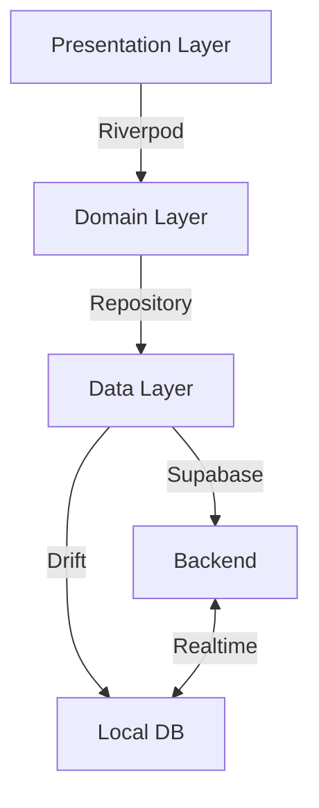

# LifeOS Quick Wins - High Impact, Low Effort

**Document Date:** 2025-11-23
**Purpose:** Actionable improvements that deliver immediate value with minimal development time

---

## Quick Win Categories

Each improvement is rated:
- ⏱️ **Time:** Estimated hours to complete
- 🎯 **Impact:** High/Medium/Low user value
- 🔧 **Complexity:** Easy/Medium/Hard technical difficulty

---

## 1. Critical Fixes (<2 hours)

### 1.1 Remove Mock Repositories
**⏱️ Time:** 30 minutes
**🎯 Impact:** HIGH (blocks production)
**🔧 Complexity:** Easy

**Problem:**
```dart
// lib/features/life_coach/ai/providers/daily_plan_provider.dart
@riverpod
GoalsRepository goalsRepository(Ref ref) {
  return MockGoalsRepository(); // ⚠️ Mock in production code!
}
```

**Solution:**
```dart
@riverpod
GoalsRepository goalsRepository(Ref ref) {
  return GoalsRepositoryImpl(
    ref.watch(appDatabaseProvider),
    ref.watch(supabaseProvider),
  );
}
```

**Files to Update:**
- `lib/features/life_coach/ai/providers/daily_plan_provider.dart`
- Update all mock repository providers

**Why This Matters:**
- Mocks will cause runtime failures in production
- Data won't persist to database
- Critical blocker for MVP launch

---

### 1.2 Add .env to .gitignore Verification
**⏱️ Time:** 15 minutes
**🎯 Impact:** HIGH (security)
**🔧 Complexity:** Easy

**Action:**
```bash
# 1. Verify .gitignore contains:
.env
*.env
.env.local

# 2. Remove any committed .env files:
git rm --cached .env
git commit -m "chore: Remove .env from version control"

# 3. Check for API keys in history:
git log --all --full-history --source -- .env
```

**Why This Matters:**
- Prevents API key leaks
- Security best practice
- Required for production deployment

---

### 1.3 Add Streak UI Display Widget
**⏱️ Time:** 1 hour
**🎯 Impact:** HIGH (gamification)
**🔧 Complexity:** Easy

**Implementation:**
```dart
// lib/features/life_coach/presentation/widgets/streak_indicator.dart
class StreakIndicator extends ConsumerWidget {
  const StreakIndicator({super.key});

  @override
  Widget build(BuildContext context, WidgetRef ref) {
    final streak = ref.watch(currentStreakProvider);

    return streak.when(
      data: (count) => Container(
        padding: const EdgeInsets.all(12),
        decoration: BoxDecoration(
          gradient: LinearGradient(
            colors: [Colors.orange, Colors.deepOrange],
          ),
          borderRadius: BorderRadius.circular(12),
        ),
        child: Row(
          mainAxisSize: MainAxisSize.min,
          children: [
            Text('🔥', style: TextStyle(fontSize: 24)),
            SizedBox(width: 8),
            Text(
              '$count day${count != 1 ? 's' : ''}',
              style: TextStyle(
                color: Colors.white,
                fontWeight: FontWeight.bold,
                fontSize: 18,
              ),
            ),
          ],
        ),
      ),
      loading: () => CircularProgressIndicator(),
      error: (_, __) => SizedBox.shrink(),
    );
  }
}
```

**Where to Add:**
- Life Coach dashboard
- Profile page
- Morning check-in page

**Why This Matters:**
- Immediate gamification feedback
- Motivates daily check-ins
- Backend already exists, just needs UI

---

### 1.4 Add Error Logging Initialization
**⏱️ Time:** 1 hour
**🎯 Impact:** HIGH (debugging)
**🔧 Complexity:** Easy

**Implementation:**
```dart
// lib/core/error/error_logger.dart
import 'package:flutter/foundation.dart';

class ErrorLogger {
  static void log(Object error, StackTrace? stackTrace) {
    if (kDebugMode) {
      print('ERROR: $error');
      print('STACK: $stackTrace');
    } else {
      // TODO: Send to Sentry/Firebase in production
      // For now, just prevent app crashes
    }
  }

  static Future<void> captureException(
    Object error,
    StackTrace? stackTrace, {
    Map<String, dynamic>? context,
  }) async {
    log(error, stackTrace);
    // Future: Add Sentry.captureException(error, stackTrace: stackTrace);
  }
}

// Update main.dart:
FlutterError.onError = (FlutterErrorDetails details) {
  ErrorLogger.captureException(
    details.exception,
    details.stack,
    context: {'library': details.library},
  );
};
```

**Why This Matters:**
- Track errors in production
- Easier debugging
- Foundation for future monitoring

---

## 2. UI/UX Quick Wins (<2 hours each)

### 2.1 Add Loading States to Buttons
**⏱️ Time:** 1 hour
**🎯 Impact:** MEDIUM (UX polish)
**🔧 Complexity:** Easy

**Problem:** Buttons don't show loading state during async operations

**Solution:**
```dart
// Create reusable component
class AsyncButton extends StatelessWidget {
  final Future<void> Function() onPressed;
  final Widget child;
  final bool isLoading;

  const AsyncButton({
    required this.onPressed,
    required this.child,
    this.isLoading = false,
  });

  @override
  Widget build(BuildContext context) {
    return ElevatedButton(
      onPressed: isLoading ? null : onPressed,
      child: isLoading
          ? SizedBox(
              width: 20,
              height: 20,
              child: CircularProgressIndicator(strokeWidth: 2),
            )
          : child,
    );
  }
}
```

**Where to Apply:**
- All form submit buttons
- Save buttons
- Login/register buttons

---

### 2.2 Add Empty State Illustrations
**⏱️ Time:** 1.5 hours
**🎯 Impact:** MEDIUM (better UX)
**🔧 Complexity:** Easy

**Implementation:**
```dart
class EmptyStateWidget extends StatelessWidget {
  final String title;
  final String message;
  final IconData icon;
  final VoidCallback? onAction;
  final String? actionText;

  const EmptyStateWidget({
    required this.title,
    required this.message,
    required this.icon,
    this.onAction,
    this.actionText,
  });

  @override
  Widget build(BuildContext context) {
    return Center(
      child: Padding(
        padding: const EdgeInsets.all(32),
        child: Column(
          mainAxisAlignment: MainAxisAlignment.center,
          children: [
            Icon(icon, size: 80, color: Colors.grey[400]),
            SizedBox(height: 16),
            Text(
              title,
              style: Theme.of(context).textTheme.headlineSmall,
              textAlign: TextAlign.center,
            ),
            SizedBox(height: 8),
            Text(
              message,
              style: Theme.of(context).textTheme.bodyMedium?.copyWith(
                    color: Colors.grey[600],
                  ),
              textAlign: TextAlign.center,
            ),
            if (onAction != null) ...[
              SizedBox(height: 24),
              ElevatedButton(
                onPressed: onAction,
                child: Text(actionText ?? 'Get Started'),
              ),
            ],
          ],
        ),
      ),
    );
  }
}
```

**Apply to:**
- Empty workout history
- Empty goals list
- Empty meditation favorites
- Empty check-in history

---

### 2.3 Add Pull-to-Refresh
**⏱️ Time:** 45 minutes
**🎯 Impact:** MEDIUM (better UX)
**🔧 Complexity:** Easy

**Implementation:**
Already has RefreshIndicator in meditation library. Apply same pattern to:
- Workout history page
- Goals list
- Check-in history
- Templates page

```dart
RefreshIndicator(
  onRefresh: () async {
    ref.invalidate(workoutHistoryProvider);
    await ref.read(workoutHistoryProvider.future);
  },
  child: ListView(...),
)
```

---

### 2.4 Add Confirmation Dialogs
**⏱️ Time:** 1 hour
**🎯 Impact:** MEDIUM (prevent mistakes)
**🔧 Complexity:** Easy

**Create Reusable Confirmation:**
```dart
// lib/core/widgets/confirmation_dialog.dart
class ConfirmationDialog extends StatelessWidget {
  final String title;
  final String message;
  final String confirmText;
  final bool isDangerous;

  static Future<bool?> show(
    BuildContext context, {
    required String title,
    required String message,
    String confirmText = 'Confirm',
    bool isDangerous = false,
  }) {
    return showDialog<bool>(
      context: context,
      builder: (context) => ConfirmationDialog(
        title: title,
        message: message,
        confirmText: confirmText,
        isDangerous: isDangerous,
      ),
    );
  }

  @override
  Widget build(BuildContext context) {
    return AlertDialog(
      title: Text(title),
      content: Text(message),
      actions: [
        TextButton(
          onPressed: () => Navigator.pop(context, false),
          child: Text('Cancel'),
        ),
        ElevatedButton(
          onPressed: () => Navigator.pop(context, true),
          style: isDangerous
              ? ElevatedButton.styleFrom(backgroundColor: Colors.red)
              : null,
          child: Text(confirmText),
        ),
      ],
    );
  }
}
```

**Add to:**
- Delete workout
- Delete goal
- Clear workout history
- Delete account

---

## 3. Performance Quick Wins (<2 hours each)

### 3.1 Add Const Constructors
**⏱️ Time:** 1 hour
**🎯 Impact:** MEDIUM (performance)
**🔧 Complexity:** Easy

**Action:**
- Add `const` to all stateless widgets that can be const
- Run: `dart fix --apply` (auto-fixes some cases)

**Example:**
```dart
// Before:
child: Text('Hello')

// After:
child: const Text('Hello')
```

**Why This Matters:**
- Reduces widget rebuilds
- Lower memory usage
- Better performance

---

### 3.2 Add Database Indexes
**⏱️ Time:** 1.5 hours
**🎯 Impact:** HIGH (performance)
**🔧 Complexity:** Medium

**Implementation:**
```dart
// lib/core/database/database.dart
@DriftDatabase(...)
class AppDatabase extends _$AppDatabase {
  @override
  int get schemaVersion => 6; // Increment

  @override
  MigrationStrategy get migration => MigrationStrategy(
    onUpgrade: (m, from, to) async {
      // ... existing migrations ...
      if (from < 6) {
        // Add indexes
        await customStatement(
          'CREATE INDEX IF NOT EXISTS idx_workout_logs_user_date '
          'ON workout_logs(user_id, timestamp DESC)'
        );
        await customStatement(
          'CREATE INDEX IF NOT EXISTS idx_check_ins_user_date '
          'ON check_ins(user_id, timestamp DESC)'
        );
        await customStatement(
          'CREATE INDEX IF NOT EXISTS idx_goals_user_status '
          'ON goals(user_id, status)'
        );
      }
    },
  );
}
```

**Why This Matters:**
- Faster queries (10-100x speedup)
- Better UX (instant list loading)
- Scales with data growth

---

### 3.3 Implement Image Compression
**⏱️ Time:** 1 hour
**🎯 Impact:** MEDIUM (performance)
**🔧 Complexity:** Easy

**Already Implemented in Profile:** Extend to all image uploads

```dart
// Create reusable service
class ImageService {
  static Future<File> compressAndResize(File file) async {
    final compressed = await FlutterImageCompress.compressAndGetFile(
      file.absolute.path,
      '${file.parent.path}/compressed_${DateTime.now().millisecondsSinceEpoch}.jpg',
      quality: 85,
      minWidth: 512,
      minHeight: 512,
    );
    return File(compressed!.path);
  }
}
```

**Apply to:**
- Profile avatar uploads
- Any future image uploads (workout photos, etc.)

---

## 4. Developer Experience Quick Wins (<2 hours each)

### 4.1 Add Code Generation Script
**⏱️ Time:** 30 minutes
**🎯 Impact:** MEDIUM (DX improvement)
**🔧 Complexity:** Easy

**Create Script:**
```bash
# scripts/generate.sh
#!/bin/bash

echo "🔨 Running code generation..."
dart run build_runner build --delete-conflicting-outputs

echo "✅ Code generation complete!"
```

**Make executable:**
```bash
chmod +x scripts/generate.sh
```

**Add to package.json (or Makefile):**
```json
{
  "scripts": {
    "generate": "dart run build_runner build --delete-conflicting-outputs",
    "watch": "dart run build_runner watch --delete-conflicting-outputs"
  }
}
```

---

### 4.2 Add Pre-commit Hook
**⏱️ Time:** 1 hour
**🎯 Impact:** MEDIUM (code quality)
**🔧 Complexity:** Easy

**Setup:**
```bash
# .git/hooks/pre-commit
#!/bin/bash

echo "🔍 Running pre-commit checks..."

# Format code
dart format lib/ test/ --set-exit-if-changed
if [ $? -ne 0 ]; then
  echo "❌ Code formatting failed. Run: dart format ."
  exit 1
fi

# Analyze code
dart analyze
if [ $? -ne 0 ]; then
  echo "❌ Dart analyze found issues."
  exit 1
fi

echo "✅ Pre-commit checks passed!"
```

**Make executable:**
```bash
chmod +x .git/hooks/pre-commit
```

---

### 4.3 Add Debug Utilities
**⏱️ Time:** 1 hour
**🎯 Impact:** MEDIUM (debugging)
**🔧 Complexity:** Easy

**Implementation:**
```dart
// lib/core/utils/debug_utils.dart
class DebugUtils {
  static void logProvider(String name, dynamic value) {
    if (kDebugMode) {
      print('🔵 PROVIDER [$name]: $value');
    }
  }

  static void logNavigation(String from, String to) {
    if (kDebugMode) {
      print('🔀 NAVIGATION: $from → $to');
    }
  }

  static void logAPI(String method, String endpoint, {dynamic response}) {
    if (kDebugMode) {
      print('🌐 API [$method] $endpoint');
      if (response != null) print('   Response: $response');
    }
  }
}
```

**Use in Development:**
- Add to provider builders
- Add to router
- Add to API calls

---

## 5. Documentation Quick Wins (<2 hours each)

### 5.1 Add README with Quick Start
**⏱️ Time:** 1.5 hours
**🎯 Impact:** HIGH (onboarding)
**🔧 Complexity:** Easy

**Create: README.md**
```markdown
# LifeOS - Life Operating System

AI-powered modular life coaching platform.

## Quick Start (5 minutes)

1. Install dependencies:
   ```bash
   flutter pub get
   ```

2. Set up environment:
   ```bash
   cp .env.example .env
   # Add your API keys to .env
   ```

3. Generate code:
   ```bash
   dart run build_runner build --delete-conflicting-outputs
   ```

4. Run app:
   ```bash
   flutter run
   ```

## Project Structure
- `lib/core/` - Shared infrastructure
- `lib/features/` - Feature modules
- `test/` - Unit & integration tests

## Key Commands
- `flutter test` - Run tests
- `dart format .` - Format code
- `dart analyze` - Check for issues

## Documentation
- [Architecture](docs/ecosystem/architecture.md)
- [Development Guide](docs/DEVELOPMENT_GUIDE.md)
- [Epic Status](EPIC_IMPLEMENTATION_STATUS.md)
```

---

### 5.2 Add Inline Code Documentation
**⏱️ Time:** 2 hours (per module)
**🎯 Impact:** MEDIUM (maintainability)
**🔧 Complexity:** Easy

**Add Dartdoc Comments:**
```dart
/// Service for generating personalized daily plans using AI.
///
/// This service analyzes the user's goals, recent check-ins, and preferences
/// to create an optimized daily task list. It uses GPT-4 for intelligent
/// task prioritization and scheduling.
///
/// Example usage:
/// ```dart
/// final generator = ref.watch(dailyPlanGeneratorProvider);
/// final result = await generator.generatePlan();
/// ```
class DailyPlanGenerator {
  // ...
}
```

**Apply to:**
- All public classes
- Complex algorithms
- Service classes

---

### 5.3 Create Architecture Diagram
**⏱️ Time:** 1 hour
**🎯 Impact:** MEDIUM (understanding)
**🔧 Complexity:** Easy

**Use tool:** https://mermaid.live/

**Create: docs/architecture-diagram.md**


---

## 6. Testing Quick Wins (<2 hours each)

### 6.1 Add Golden Test for Key Screens
**⏱️ Time:** 2 hours
**🎯 Impact:** MEDIUM (UI consistency)
**🔧 Complexity:** Medium

**Implementation:**
```dart
// test/features/life_coach/presentation/pages/morning_check_in_page_test.dart
void main() {
  testWidgets('Morning check-in page golden test', (tester) async {
    await tester.pumpWidget(
      ProviderScope(
        child: MaterialApp(
          home: MorningCheckInPage(),
        ),
      ),
    );

    await expectLater(
      find.byType(MorningCheckInPage),
      matchesGoldenFile('goldens/morning_check_in_page.png'),
    );
  });
}
```

**Run:**
```bash
flutter test --update-goldens
```

---

### 6.2 Add Provider Tests
**⏱️ Time:** 1 hour (per provider)
**🎯 Impact:** HIGH (stability)
**🔧 Complexity:** Easy

**Example:**
```dart
void main() {
  test('DailyPlanNotifier generates plan successfully', () async {
    final container = ProviderContainer(
      overrides: [
        dailyPlanGeneratorProvider.overrideWith((ref) => mockGenerator),
      ],
    );

    final notifier = container.read(dailyPlanNotifierProvider.notifier);
    await notifier.generatePlan();

    final state = container.read(dailyPlanNotifierProvider);
    expect(state.hasValue, isTrue);
  });
}
```

---

## 7. Priority Order for Implementation

### Week 1 (Critical)
1. ✅ Remove mock repositories (30 min)
2. ✅ Verify .env security (15 min)
3. ✅ Add streak UI widget (1 hour)
4. ✅ Add error logging (1 hour)
5. ✅ Add loading states to buttons (1 hour)
6. ✅ Add README (1.5 hours)

**Total: 5 hours, 45 minutes**

### Week 2 (High Impact)
7. ✅ Add database indexes (1.5 hours)
8. ✅ Add empty state illustrations (1.5 hours)
9. ✅ Add confirmation dialogs (1 hour)
10. ✅ Add pull-to-refresh (45 min)
11. ✅ Add const constructors (1 hour)
12. ✅ Add code generation script (30 min)

**Total: 6 hours, 15 minutes**

### Week 3 (Polish)
13. ✅ Add pre-commit hook (1 hour)
14. ✅ Add debug utilities (1 hour)
15. ✅ Add inline documentation (2 hours)
16. ✅ Add architecture diagram (1 hour)
17. ✅ Add golden tests (2 hours)
18. ✅ Add image compression (1 hour)

**Total: 8 hours**

---

## Summary

**Total Quick Wins:** 18 improvements
**Total Estimated Time:** ~20 hours
**Total Impact:** HIGH

These improvements require minimal effort but deliver immediate value:
- Better UX (loading states, empty states, confirmations)
- Better performance (indexes, const widgets, image compression)
- Better DX (scripts, hooks, documentation)
- Better reliability (error logging, tests)

**Recommended Approach:**
- Start with Week 1 critical items
- Implement during normal sprint work (not dedicated sprint)
- Can be distributed across team members
- Each item is independently valuable

---

**Document End**
